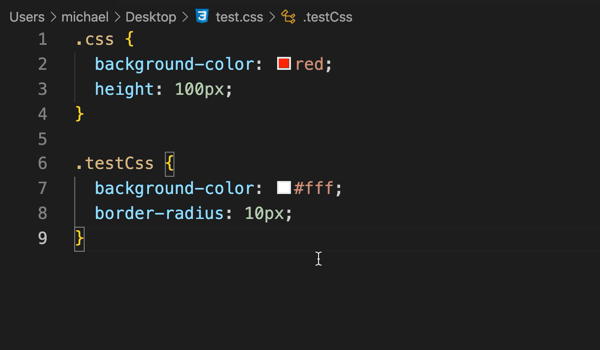

# CodeReplacer

Let's transform className and css as you like

## Features

- Transform Css To Styles
- Transform Styles To Css
- Transform ClassName To Styles
- Transform Styles To ClassName
- Transform Css To Camel Style
- Transform Camel To Css Style

## Demo

### transform between css and styles

### transform className

## Usage

Transform css/less code to styles with `alt + shift + s` key(for mac :`option + shift + s`).
Transform styles code to css with `alt + shift + c` key(for mac :`option + shift + c`).
Or transform your code with `shift + command + P` key, and choose the command you want to transform.

The following are all commands:

- cssToStyle: Transform css/less To Styles,transform css/less to JSX style.

- styleToCss: Transform Styles To Css,transform JSX style to css,which is the reverse process of first usage.

- classNameToStyles：Transform ClassName To Styles，transform class-name to styles.className，eg:`className='test-name'` => `className={styles.testName}`.

- stylesToClassName：Transform Styles To ClassName,which is the reverse process of third usage,eg:`className={styles.testName}` => `className='test-name'`.

- cssToCamel：Transform Css To Camel Style,eg:`.css-name {}` => `.cssName {}`.

- camelToCss：Transform Camel To Css Style,which is the reverse process of fifth usage,.eg：`.cssName {}` => `.css-name {}`.